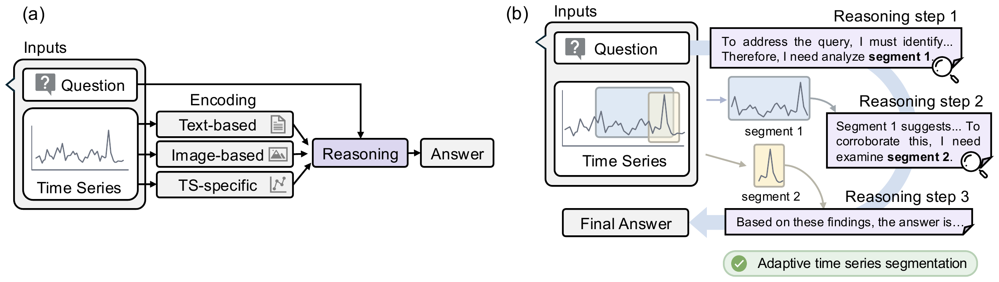
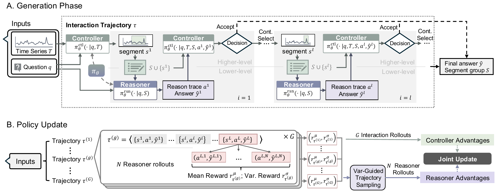

<h1 align="center">ARTIST: Adaptive Reasoning for Time-Series via Temporal Selection</h1>

<p align="center">
  <a href="https://arxiv.org/abs/2602.18645"></a>
  <a href="https://icml.cc/"></a>
  <a href="https://github.com/mims-harvard/ARTIST/blob/main/LICENSE"></a>
  
</p>

<p align="center">
  <b>Adaptive Time Series Reasoning via Segment Selection</b><br>
  Shvat Messica, Jiawen Zhang, Kevin Li, Theodoros Tsiligkaridis, Marinka Zitnik<br>
  <i>Proceedings of the 43rd International Conference on Machine Learning (ICML), 2026</i>
</p>

<p align="center">
  
</p>

## 🔍 Overview

Time-series reasoning tasks start with a natural-language question and require **targeted** analysis of a time series. Evidence may span the full series or appear in only a few short intervals, so the model must decide *what to inspect*. Most existing approaches encode the **entire** time series into a fixed representation before inference, regardless of relevance.

**ARTIST** formulates time-series reasoning as a **sequential decision problem**. It interleaves reasoning with adaptive temporal segment selection using a **controller–reasoner** architecture and trains both roles with reinforcement learning:

- A high-level **controller** selects the next informative segment and decides when to stop, conditioned on the question and intermediate outputs.
- A low-level **reasoner** produces segment-conditioned reasoning traces and the final answer.

Rather than relying on a static summary of the full sequence, ARTIST **actively acquires** task-relevant information at inference time. A novel **hierarchical, collaborative self-play** post-training method lets a single policy excel at both segment selection and question answering.

## ✨ Key Contributions

1. **Adaptive segment selection for time-series reasoning.** The model iteratively chooses temporal segments to inspect and updates its reasoning based on retrieved segments, with no pre-defined segment labels.
2. **Hierarchical, collaborative self-play RL.** A post-training method that separates segment selection from answer generation and trains each role with role-aligned learning signals — a *reliability* reward for the controller and a correctness/format reward for the reasoner.
3. **Strong empirical results.** On six benchmarks, ARTIST outperforms seven strong baselines (text LLMs, time-series encoder models, and vision-language models) while consuming a smaller fraction of the input series.

## 🧠 Method

<p align="center">
  
</p>

ARTIST is a single policy `π_θ` (Qwen3-4B backbone + a lightweight MLP patch encoder) that operates in two roles: a **controller** that selects the next segment and decides when to stop, and a **reasoner** that produces segment-conditioned reasoning and the final answer. Inference unfolds as an interleaved trace that alternates natural-language reasoning with segment-selection tool calls:

```
<think> reasoning ... </think>
<timeseries_selection_tool> [x1, y1] </timeseries_selection_tool>
<think> reasoning ... </think>
<timeseries_selection_tool> [x2, y2] </timeseries_selection_tool>
<think> reasoning ... </think>
<answer> A / B / C / D / E </answer>
```

Training proceeds in two stages:

1. **Supervised fine-tuning (SFT)** — LoRA-based fine-tuning on curated reasoning traces that interleave natural language with segment-selection tool calls.
2. **Reinforcement learning (RL)** — full-parameter fine-tuning via collaborative self-play with **hierarchical policy optimization**: trajectory-level credit for the controller and final-round, segment-conditioned optimization for the reasoner, with **variance-guided sampling** of reasoner rollouts.

## ⚙️ Installation

```bash
git clone https://github.com/mims-harvard/ARTIST.git
cd ARTIST

# Create an environment (Python 3.10+)
conda create -n artist python=3.10 -y
conda activate artist

pip install -r requirements.txt
```

`requirements.lock.txt` contains the exact frozen environment used in our experiments (for reproducibility).

Training and inference were run on **NVIDIA H100** GPUs (SFT on 1×H100, RL on 4×H100).

## 🚀 Usage

### 1. Supervised fine-tuning (SFT)

```bash
python cli_qwen_cot.py fit \
  --config configs/sft_<dataset>.yaml
```

### 2. Reinforcement learning (RL)

Per-dataset RL configs are provided in [`configs/`](configs/) (`rl_ecg.yaml`, `rl_rcw.yaml`, `rl_tsqa.yaml`, `rl_sleep.yaml`, `rl_trqa.yaml`, `rl_eti.yaml`). Edit the `model_path` (SFT checkpoint) and `dataset.init_args.cache_path` fields, then:

```bash
python train_controller_reasoner_opt.py -c configs/rl_tsqa.yaml
```

### 3. Inference / evaluation

The same config is reused at inference time via `--dataset_config`:

```bash
python inference_controller_reasoner_atk.py \
  --model_path /path/to/artist-rl-tsqa \
  --task TSQA \
  --dataset_config configs/rl_tsqa.yaml \
  --include_full_ts_initially \
  --passk 1,2,4,8 \
  --output_file predictions.json
```

> Default sampling temperatures: reasoner `0.7`, controller `1.0`. Accuracy and F1 are reported as averages over 8 independent runs per dataset.

## 📑 Citation

```bibtex
@inproceedings{messica2026artist,
  title     = {Adaptive Time Series Reasoning via Segment Selection},
  author    = {Messica, Shvat and Zhang, Jiawen and Li, Kevin and
               Tsiligkaridis, Theodoros and Zitnik, Marinka},
  booktitle = {Proceedings of the 43rd International Conference on Machine Learning (ICML)},
  year      = {2026},
  eprint    = {2602.18645},
  archivePrefix = {arXiv}
}
```

## 📬 Contact

For questions, please open an issue or contact [Shvat Messica](mailto:shvat.messica@fas.harvard.edu) and [Marinka Zitnik](mailto:marinka@hms.harvard.edu).
